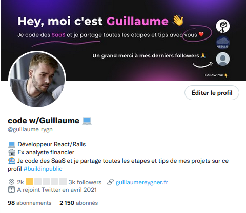

# 🤖 Twitter Bot Header



## How to setup for your Twitter

Add a '.env' file and insert these lines:

```
API_KEY='' # API key
API_SECRET='' # API key secret
ACCESS_TOKEN='' # Access token
ACCESS_SECRET='' # Access token secret
SCREEN_NAME='' # Twitter handle (without the @ character)
```

To get the API keys, you need to [apply for a Twitter Developer account](https://developer.twitter.com/en/apply-for-access).  
It's free and take ~5 minutes.

Lastly, add a banner template file with this specific name : twitter-banner.png.

You'll have to make sure the banner template file is an image in PNG format.

Besides, you'll have to resize it by following the [official sizing recommendations](https://help.twitter.com/en/managing-your-account/common-issues-when-uploading-profile-photo):
 - width: 1500px,
 - height: 500px 

i.e. 1500x500 in px

## Run the script

Install dependencies:

```shell
yarn
```

or

```shell
npm install
```

Start the app:

```shell
node index.js
```

Keep it running with a process manager like [pm2](https://pm2.io/) and have fun!

## How the script works

[French Tutorial here](https://hot-jujube-90c.notion.site/Twitter-Bot-Header-eef6c49eee4c4762bca9e4a50aefd91e).

The script fetches new replies every 60 seconds (to avoid [rate limit](https://developer.twitter.com/en/docs/twitter-api/v1/accounts-and-users/follow-search-get-users/api-reference/get-users-show)).

## Development guidelines

Eslint & Prettier have been configured on this repository.
Don't forget to run them before each commit 
(or after a pull-request is rebased onto the latest commit of the main branch).

How to reformat with both eslint and prettier?

```
npm run lint:fix
```

How to run eslint?

```
npm run lint
```

## Most importantly

Follow me on Twitter! [@guillaume_rygn](https://twitter.com/guillaume_rygn)

Thanks!
